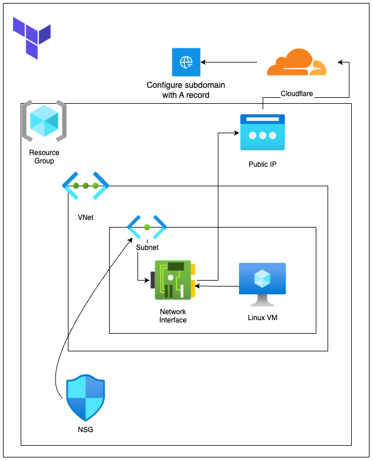

# Tetris Deployment with Terraform, Docker, and NGINX

The project demonstrates the deployment of a Tetris web application using **Terraform**, **Azure**, **Docker**, and **NGINX**. The application is accessible over HTTPS at [https://tetris.sohailsajid.dev](https://tetris.sohailsajid.dev).

---

## Table of Contents

1. [Project Overview](#project-overview)
2. [Technologies Used](#technologies-used)
3. [Infrastructure Setup](#infrastructure-setup)
4. [Docker Configuration](#docker-configuration)
5. [NGINX Configuration](#nginx-configuration)
6. [SSL Configuration with Certbot](#ssl-configuration-with-certbot)
7. [GitHub Actions Workflow](#github-actions-workflow)

---

## Project Overview

The objective of this project was in response to a technical challenge: setting up a Linux environment on Azure to host a web application. The application was deployed on an Azure Linux Virtual Machine (VM) using Terraform to automate the provisioning of cloud resources. I decided on Terraform because of its ability to manage infrastructure as code, enabling repeatable and scalable deployments.

Docker was utilised to containerise the application, ensuring consistency and portability across environments. In doing so, it simplified application packaging and dependency management

NGINX was configured to efficiently serve the application and provide HTTPS for secure communication, enhancing performance and security.

---

## Technologies Used

 - Used for Infrastructure as Code (IaC) to provision and manage Azure resources efficiently.

 - Cloud provider hosting the Linux virtual machine for the Tetris application.

 - Used to containerise the Tetris web application for portability and consistency.

 - Configured as a reverse proxy to route traffic and manage HTTPS.

 - Provided free SSL/TLS certificates to secure communication with HTTPS.

 - Utilised for version control.

 - Automated CI/CD pipeline to streamline the deployment process.

---

## Infrastructure Setup



The diagram above showcases the Terraform-managed infrastructure deployed on **Azure** and integrates with **Cloudflare DNS**. It highlights relationships between resources, such as the Virtual Network, Subnet, Public IP, Network Security Group (NSG), and DNS records.

### **Azure Resources**

1. **Azure Resource Group**  
   The central container organising all related resources in this project.

2. **Virtual Network (VNet)**  
   Provides an isolated, secure communication channel within the Azure infrastructure.

3. **Subnet**  
   Segments the Virtual Network to host the Virtual Machine and associated resources.

4. **Network Interface**
   Connects the VMto the Subnet and associates the Public IP.

5. **Network Security Group (NSG)**  
   Controls inbound and outbound traffic, allowing access only to essential ports:

   - `22` - SSH for remote access
   - `80` - HTTP traffic
   - `443` - HTTPS traffic
   - `8080` - Internal port for the Dockerised Tetris application

6. **Public IP**  
   Allocated to expose the Virtual Machine to the internet.

7. **Linux Virtual Machine (Ubuntu 22.04)**  
   A compute instance provisioned to host the application. It is configured automatically via Terraform’s `custom_data` to:
   - Install **Docker** to run the Tetris application container.
   - Install **NGINX** for reverse proxying HTTP/HTTPS traffic.
   - Install **Certbot** for SSL certificate management.

### **Cloudflare DNS Integration**

- **DNS A Record**  
   Points the subdomain `tetris.sohailsajid.dev` to the VM’s public IPv4 address, ensuring the application is accessible over the internet.

---

## Docker Configuration

The Tetris web application is containerised using Docker:

- The image is pulled from **Docker Hub**: `sajid79/tetris-js-app:amd64`.
- The application runs on port `8080`, which is proxied by NGINX.

Commands to run the container:

```bash
docker pull sajid79/tetris-js-app:amd64
docker run -d -p 8080:80 sajid79/tetris-js-app:amd64
```

## NGINX Configuration

NGINX acts as a reverse proxy to route traffic to the Docker container and serve the application securely. In theory:

- HTTP traffic (port 80) is redirected to HTTPS (port 443).
- HTTPS is configured using certificates from Let's Encrypt

```
# HTTP server block: Redirect HTTP to HTTPS
server {
    listen 80;
    server_name tetris.sohailsajid.dev;

    if ($host = tetris.sohailsajid.dev) {
        return 301 https://$host$request_uri;
    }

    return 404; # Catch-all for invalid requests
}

# HTTPS server block
server {
    listen 443 ssl;
    server_name tetris.sohailsajid.dev;

    location / {
        proxy_pass http://127.0.0.1:8080;
        proxy_set_header Host $host;
        proxy_set_header X-Real-IP $remote_addr;
    }

    # SSL configuration managed by Certbot
    ssl_certificate /etc/letsencrypt/live/tetris.sohailsajid.dev/fullchain.pem;
    ssl_certificate_key /etc/letsencrypt/live/tetris.sohailsajid.dev/privkey.pem;
    include /etc/letsencrypt/options-ssl-nginx.conf;
    ssl_dhparam /etc/letsencrypt/ssl-dhparams.pem;
}
```

## SSL Configuration with Certbot

I used Certbot to generate SSL/TLS certificates for HTTPS:

```
sudo apt install -y certbot python3-certbot-nginx
```

```
sudo certbot --nginx -d tetris.sohailsajid.dev --non-interactive --agree-tos --email sohailsajid023@outlook.com
```

## GitHub Actions Workflow

The deploy-application.yaml workflow automates the deployment process, ensuring an efficient and consistent pipeline for the Tetris Application. The workflow is triggered manually using `workflow_dispatch` and performs the following key steps:

1. Validation:

- Ensures Docker, NGINX, and Certbot are installed on the target VM and scans the Docker image for vulnerabilities using Trivy.

2. Deployment:

- Pulls and runs the Docker container hosting the application.

3. Verification:

- Verifies SSL certificates for HTTPS access.

4. Pull Request Creation:

- Once deployment and verification succeed, a pull request is automatically created to merge changes from the dev branch into the main branch.
